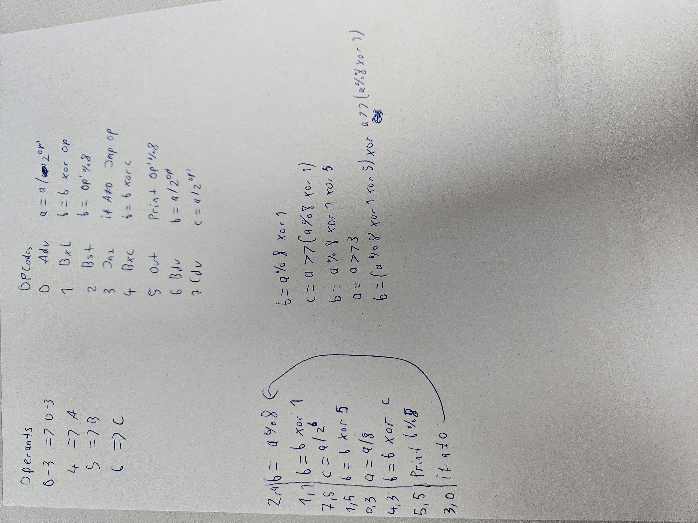

# Day 17

Part 1 pretty straightforward, just implement according to the instruction. 

Part 2 was another job for Z3 and thus solved in python. The program is handcrafted to solve my input. It's pretty simple since the only jump is the last instruction back to the beginning. Since we know that the output has to have exactly 16 characters (because that's how long my program input was), we can just loop over the instructions and execute the program.

